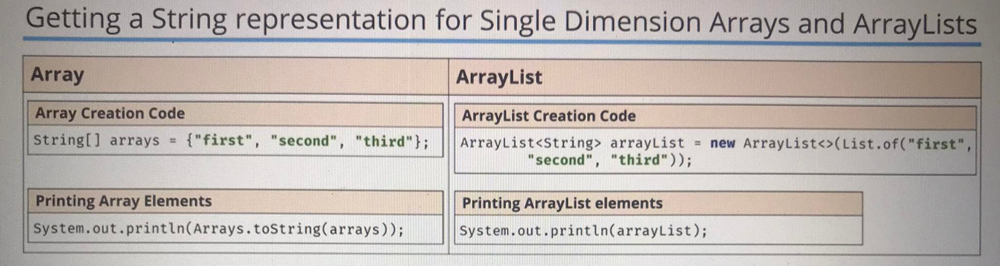
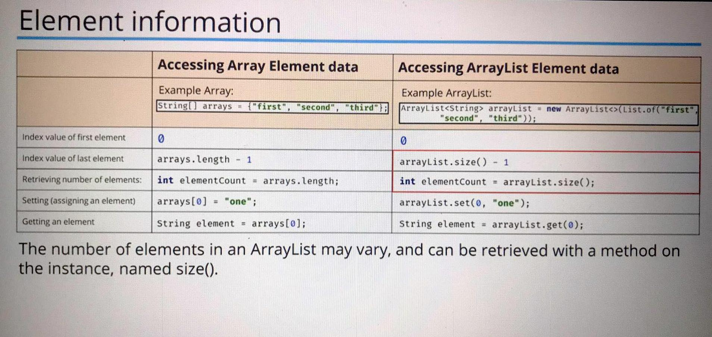
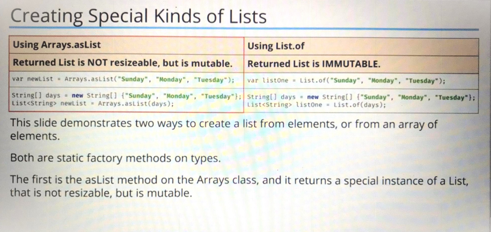

# 1. Operatory
## 1.1 **==** **=**  **equals**.

- dla zmiennych liczbowych
int linia = 50;
if (linia == 50){   
    \\dla wartości liczbowych musi być ==
    ...
}

- dla zmiennych logicznych
boolean linia = false;
if (linia = true){   
    \\**=** oznacza przypisanie zmiennej nowej warości -> "zmienna od teraz = true". 
    \\**==** będzie oznaczać "jeżeli linia = true, to zrób to i tamto" 
}

## 1. 2 Ternary operand -> boolean y = x ? true : false (potrójnuy operator)
Stosowane dla wszystkich rodzajów zmiennych ale obie zmienne byszą być tego samego typu

boolean *samochód* = false;

boolean *rower* = *samochód* ? true : false;

- *samochód* jest wartością którą testujemy.
- po ? (true) - jest wartością którą przypiszemy wartości testowanej (*samochód*) jeżeli ma wartość true.
- po : (false) - jest wartością jaką przypiszemy jeżeli wartość testowanej(*samochód*) ma wartość false.

# 2. pętla IF 

Jeżeli nie napiszemy {}, to wg zasad określonych w pętli, wykona sie pierwsza linija kodu zaraz po zainicjalizowaniu pętli: 

int score = 50;
if (score == 50)
System.out.println("to się wykona");

System.out.println("to się wykona niezależnie od pętli")

# 3. Metody

można nie podawać wartości a jeżeli to boolean. Jeżeli wartość a = true to wykona się return z:

public static int calculate(int a, int b){
    if(a){
        return z;
    }
    return y;
}

jeżeli a == true to metoda zakończy działanie na "return z". jeżlei a == false to wyświetli się "return y"

# 4. Overloading / Overridding

- **Overloading** - ta sama nazwa metody -> inne parametry. (odwołuje się to do polimorfismu javy)
  - **Stosowane do metod STATIC oraz INSTANCE.**
  - Overloaded methods...:
    - mogą zwracać inne typy parametrów
    - mogą mieć inne modyfikatory dostępu
    - mogą sprawdzać inne wyjątki
- **Overridding** - implementowana metoda z klasy nadrzędnej do klasy podrzędnej
  - **Stosowane tylko do metody INSTANCE.**
  - Metoda nadpisana ma taką samą nazwę i takie same argumenty,
  - Metody nadpisane można oznaczać znacznikiem @Override
  - Method Overriding (Runtime Polymorphism/Dynamic Mothod Dispatch)
  - Overrided methods...:
    - muszą zwracać ten sam typ parametru jak w parents class
    - nie moga mieć mniejszego dostępu (modyfikatory dostępu) niż w parents class
      tj. jeżeli w subklasie jest protected, to klasa podrzędna może być protected lub public.
    - nie mogą sprawdzać innych wyjątków niż w parent class
  - można nadpisywać metody tylko w subklasach
  - konstruktory (constructors), final methods i private methods nie mogą być nadpisywane.
  - 

# 5 Switch case:

**typ zmiennej w () nie może być double i long**

    **switch **               vs.       **switch statement**

    switch (value){                     switch (value){
    case x:                             case x -> code for x;
        // code for x;                  case y -> code for y;
        break;                          case 1, 2, 3 -> {
    case y:                                     System.out.println("Was a 3, a 4 or  a 5");
        //code for y                            System.out.println("It was a" + value);
        break;                          }
    case 1: case 2: case 3:             default -> code for resst;
        //code for three cases;         }
        brak;
    default:
        //code for resst;
        break;
    }
 
dla String można używać:
    return      lub     **yield**
    -> "1st";    /      -> {yield "1st"}

    switch (month){
        case "January";
        case "February";
        case "March";
            return "1st"; / {yield "1st"}
    }
return "bad"; -> jeżeli chcemy zwrócić z metody 

**Switch statement**

    switch (month) {
        case "January", "February", "March" -> "1st"; //  {yield "1st"}
        default -> "bad"
    }

# 6. Identyfikatory dostępu 
- Class:
  - public - any other class in any package can access this class
  - protected - dla class brak
  - private - dla class brak
  - none - tzw. package access - class is accessible only to classes in the same package
- Methods / variables:
  - public - any other class in any package can access this class
  - protected - allows classes in the same package, and any subclasses in other packages to have access to the member
  - none - tzw. package access - class is accessible only to classes in the same package
  - private - no other class can access this member.
  
# 7. Enkapsulacja
- Zdolność chowania pól i metod przed publicznym dostępem - gettery i settery
- Building of behavior and attributes on a single object

# 8. słowo kluczowe STATIC

- Static sprawia, że nadane pole będzie przypisane do klasy, a nie do danej instacji (obiektu) tej klasy.
sprawia, że coś jest wspólne dla wszystkich obektów tej klasy.
- jeżeli zmieni się parametr static, w jednej instancji, to zmieni się on również w pozostałych.

- Może to być przydatne np w sytuacji, gdy wiemy i chcemy zrobić tak, żeby wszystkie
obiekty danej klasy miały jakąś część wspólną. Taką częścią może być właśnie jakaś 
wartość pola statycznego.

  - Pola Statyczne:

      Pola statyczne różnią się od pól instancji (obiektów) tym, że są one współdzielone 
  przez wszystkie obiekty tej klasy, tzn. przynależą one do całej klasy, a nie konkretnie utworzonego obiektu.
  używane najczęściej do przechowywania "counters", stałych jak np PI, tworzenia i kontrolowania
  dostępu do źródeł.

  - Metody statyczne (te przypisane do klasy) nie mogą korzystać z pól i metod niestatycznych (tych przypisanych 
  tylko do konkretnego obiektu).

      Wszystkie obiekty klasy mają dostęp do pól i metody statycznych. Mało tego – do pól i 
  statycznych mamy dostęp nawet wtedy, gdy nie utworzymy żadnego obiektu klasy. 
  Wartości pól statycznych są współdzielone przez wszystkie obiekty klasy – w przeciwieństwie 
  do pól niestatycznych (instancji), których własne egzemplarze ma każdy obiekt klasy, pola 
  statyczne są tworzone jako pojedyncze wartości/obiekty.

      Metody statyczne mają dostęp jedynie do metod i pól, które także są statyczne. 
  Nie mogą one odnosić się do niestatycznych pól – nie operują one na konkretnych obiektach 
  klasy, lecz w kontekście całej klasy – nie mają one dostępu do obiektu this, który wskazuje 
  na obiekt, na rzecz którego metoda została wywołana.

      Zobaczymy teraz przykłady każdej z powyżej opisanych cech pól i metod statycznych.

          public class PrzykladStatic {
              private int poleInstancji;
    
              private static int poleStatyczne = 5;
    
              public PrzykladStatic(int poleInstancji) {
                  this.poleInstancji = poleInstancji;
              }
    
              public static void main(String[] args) {
                  System.out.println("Pole statyczne (przez klase): " +
                      PrzykladStatic.poleStatyczne // 1
                  );
                  PrzykladStatic obiekt1 = new PrzykladStatic(10);
                  System.out.println("Pole statyczne (przez obiekt1): " +
                      obiekt1.poleStatyczne // 2
                  );
              }
          }
    - Metoda Static 
  Jeżeli definiujesz metodę, która jest bezstanowa, czyli nie musisz się w niej odwoływać do pól obiektu, 
  to możesz ją zdefiniować jako metodę statyczną. Przykładowo, jeżeli tworzymy metodę, która ma sumować dwie liczby, 
  to najlepiej będzie ją zdefiniować właśnie jako statyczną. Metoda taka ma jasne wejście, np. dwie 
  liczby i wyjście, czyli wynik sumowania.

          class Calc {
             static int sum(int a, int b) {
                return a + b;
             }
          }
Dzięki temu, że metoda jest statyczna, to w celu jej wywołania, nie musimy tworzyć obiektu:

        class CalcTest {
            public static void main(String[] args) {
                int sum = Calc.sum(5, 10);
                System.out.println("Suma: " + sum); //15
            }
        }

Gdyby metoda nie była statyczna, to musielibyśmy to zapisać tak:

        class CalcTest {
            public static void main(String[] args) {
                Calc calc = new Calc();
                int sum = calc.sum(5, 10);
                System.out.println("Suma: " + sum); //15
            }
        }

# 9. Konstruktor (pckage b_inheritance -> Ex1_bankAccount)
- służy do przypisania parametrów obiektu klasy,
- używany przy tworzeniu obiektu - instancja klasy np:
    Class obiekt = new Class (parametr 1, parametr 2);
- nazwa ta sama co nazwa klasy,
- nie zwraca żadnych wartości,
- jezeli nie ma zadeklarowanego konstruktora, to tworzony
jest default constructor,
- liczba parametrów, ich kolejnosć lub typ w nadpisywanych konstruktorach musi się różnić.

## 9.1 Constructor chaining - łańcuch konstruktorów
- Wywołanie w konstruktorze innych konstruktorów.
- można wywołać konstruktor tylko za pomocą innego konstruktora,
- nalezy użyć this(innyConstruktor), aby wywołać inny construktor jako parametr,
- this musi być pierwszym wymaganym elementem, jeżeli używamy z innego contruktora np:
            `public bankAccount(){
                this("0000",2.5,"default Name",
                    "default email", "default phone number");
                System.out.println("Empty constructor");
            }`

# 10. POJO - Plain Old Java Object (bean/JavaBean)

- posiada tylko pola instancji
- służy do przechowywania danych i podawania ich między kolejnymi klasami
- zazwyczaj ma mało o ile jakiekolwiek metody nie będące getterami i setterami
- A JavaBean is just POJO, with some extra rules applied to it
- A POJO is sometimes calles an Entity, because it mirrors database entieties,
- Another acronim is DTO, for Data Transfer Object. it's an object that can be modeled as just data.

## 10.1 The Records - immytable

Tworzy POJO - bez definiowania jego zawartości: 

`public record RecordStudent(String id, String name, String dateOfBirth, String classList) {
}`

Poprzez zadeklarowanie pól w nawiasach, Records sam tworzy ciało, ale nie pokazując go tj 
- pole final dla każdego komponentu z nawiasu
- metody dające dostęp do danych, w nazwie nie ma getName wystarczy name  
- metodę toString().

Różnica między POJO a Record:
- recordów nie da się modyfikować - są immutable.

# 11. super() / super / this / this()

**Stosowane tylko w metodach instancji. Nie można używać ich w elementach static**

- this. - odwołuje się do pól klasy. Dzięki zastosowaniu w metodzie:
this.poleKlasy = poleMetody

Przypisujemy polu zadeklarowanej w klasie parametr zadeklarowany w metodzie o tej samej nazwie.

Stosuje się je dla parametrów i pól tej samej klasy.

- super. - wywoływanie metod klas nadrzędnych w klasie podrzędnej. 
Metody mają taką samą nazwę.

- this() stosowany do odwoływania się w konstruktorze do innego konstruktora tej samej klasy.
Musi być użyte, na początku konstruktora.

- super () ma podobne zastosowanie jak this().
Musi być użyte, na początku konstruktora.
Super pozwala się odwołać do konstruktora klasy nadrzędnej.

## super() vs. this() 

Super oraz this nie może być wywołane jednocześnie w tym samym konstruktorze.

Jeżeli nie odniesiemy się do konstruktora poprzez wywołanie super(), java domyślnie stworzy taki
konstruktor, odwołując się do klasy nadrzędnej.

Jeżeli klasa nadrzędna nie ma domyślnego konstruktora, wówczas trzeba specjalnie wywołać super()
konstruktorze, podając odpowiednie argumenty dla tego konstruktora.

# 12 Polimorfizm

jedna klasa sprawia ze obiekty tej klasy moga mieć różne postacie.   

# 13 toString ()

    class Main Extends Object{
        psvm(){
            Student max = new Student ("Max", 21);
            sout(max.toString());
        }   
    }
    class Student{
        private String name;
        private int age;
    
        Student (String name, int age){
            this.name = name;
            this.age = age;
        }
    }

When an instance is created, it's assigned  a hashCode, and that hashCode is what can
tell us if our multiple references,  are pointing to a single instance.
It's a mechanism for comparison, in other words. This really is like an address for a house,
which we talked about in our  examples, to explain the difference
between references and objects or instances. Anyway, this isn't what we want printed out,  
we really want to print out the  name and age of our student. 

W takim przypadku otrzymamy Student @65as776 gdzie @...jest "adresem" obiektu.
Aby wyświetlała się prawidłowa nazwa, należy do clasy student overrideować metodę toString() i ją zmodyfikować

    class Main Extends Object{
        psvm(){
            Student max = new Student ("Max", 21);
            sout(max.toString());
        }   
    }

    class Student{
        private String name;
        private int age;
    
        Student (String name, int age){
            this.name = name;
            this.age = age;
        }
        
        @Override
        public String toString (){
        return name + "is" + age;
        }
    }

Wówczas wyświetli się Max is 21. Nadpisywanie klas bez ich modyfikacji nie ma sensu.

# 14 Kopiowanie płytkie i głębokie (shallow copy / deep copy)

Klonowanie polega na stworzeniu nowego obiektu (nowej referencji) w oparciu, o istniejący już obiekt.
- W metodzie main, w której wywoływany jest metoda clone() musi znaleźć się - throws CloneNotSupportedException
- Klonowanie obiektów odbywa się za pomocą metody clone().
- Należy w klasie kolowanej zaimplementować interface Clonable i override metode wywoływaną przez ten interface.
- Domyślnie metoda clone() jest dostępna w obrębie pakietu, ale można zmienić modyfikator na public.
- Utworzony sklonowany obiekt będzie typu Object dlatego aby był typu obiektu, który klonowaliśmy, należy go rzutować:
  np. klonowanie punktu 1 i nadanie punktowi 2 typu klasu Punkt

    Punkt punkt2 = (Punkt) punkt1.clone();  

- **Płytkie kopiowanie obiektów**
Płytkie klonowanie sprawdz się w przypadku gdy klonujemy obiekt, w którym zadeklarowane są pola o prymitywnych typach.
Płytkie kopiowanie obiektów tworzy co prawda nowy obiekt i kopiuje pola, ale pola kopiuje jedynie na zasadzie
przepisania wartości pól typów prostych oraz przypisania tych samych referencji w przypadku pól typów obiektowych.
Nie występują żadne problemy, ponieważ przechowuje ona jedynie dwa pola typu int (typ prosty).
Jeżeli zostanie sklonowany obiekt, w którym zadeklarowane są pola typu Obiektowego, wówczas zaczną wyskakiwać błędy
wynikające z braku utworznoych nowych refentencji do pól obiektowych. 

- **Głebokie klonowanie**
Poprzez wpisanie innej deklaracji w nadpisanej metodzie Object w klonowanej klasie (Odcinek), zostaną sklonowane również
pola w obiektach typu obiektowego w niniejszej klasie. Aby to zostało zrobione należy w @ sklonować poszczególne pola klasy niżej:

    @Override
        public Object clone() throws CloneNotSupportedException {
            Odcinek odcinek = new Odcinek();
            Punkt pStart = (Punkt) this.getStart().clone();
            Punkt pKoniec =  (Punkt) this.getKoniec().clone();
            odcinek.setStart(pStart);
            odcinek.setKoniec(pKoniec);

             return odcinek;
     }

# 15 Formatowanie tekstu w kodzie:

- \t - tabulator
- \n - enter
- \" - cudzysłów w tekst
- \\ - ukośnik
- \u2022 - kropka(punktor)
- " " " - rozpoczęcie i zakończenie bloku tekstu (nie potrzebuje + i "")
- System.out.printf("Masz %d lat", age); - w miejsce %d wprowadzi wcześniej zadeklarowaną zmienną age;
  - 'f' - %f - stosowane do zmienno przecinkowych, 
  - 'd' - %d - stosowane do całkowitych
  - 'n' - %n - podobne działanie do \n 
  - %.2f - wyświetli dwa miejsca po przecinku
  - 'c' - %c - char
  - System.out.printf("Age = %d, Birth year = %d", age, yearOfBirth); <- działa to też tak
  - formattedString = "Your age is %d".formatted(age); <- działa to też tak

# 16 Kompozycja a dziedziczenie

Z koncepcyjnego punktu widzenia kompozycja oznacza, że "obiekt jest zawarty w innym obiekcie" . 
Jest to relacja "całość – część" ( B "zawiera" A). Np. obiekty typu Pojazd zawierają obiekty typu Rozmiar, Koła, Silnik itd..
Kompozycję uzyskujemy poprzez definiowanie w nowej klasie pól, które są obiektami istniejących klas. (klasa pod klasą)

Stworzenie kilku klas w głównej klasie kolejnych klas jedna pod drugą sprawia, że możliwe jest dziedziczenie 
po klasie głównej, ale przez to, że są tam też pozostałe klasy w subklasie będą również dostępne klasy zadeklarowane pod główną klasą:
przykład: 
stworzona klasa Komputer a pod nią klasy monitor, płyta główna, RAM.
Przy tworzeniu nowej klasy MójKomputer, wystarczy dodać "extends Komputer" aby mieć dostęp do klas monitor, płyta główna, RAM.

- kompozycja - wiele klas - działa na zasadzie "B HAS A"
- dziedziczenie - działa na zasadzie "B IS A".

# 17 Array vs ArrayList 

